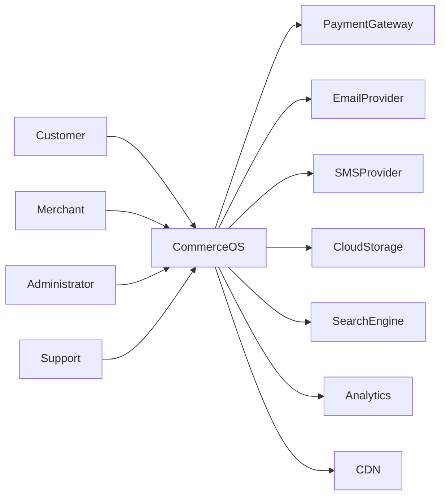
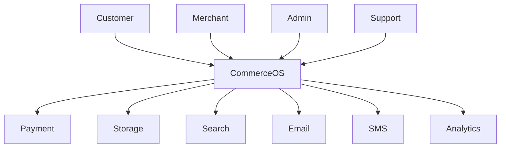
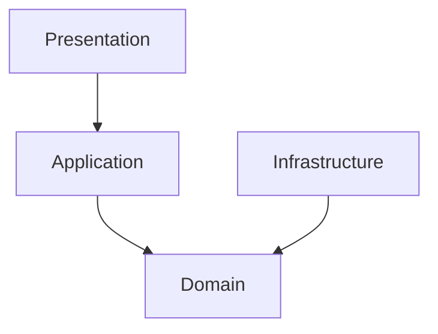

# Architecture Overview

---

# 1. Purpose

This document establishes the canonical software architecture for CommerceOS.

It defines:

- Architectural vision
- Architectural principles
- System boundaries
- Architectural styles
- Quality attributes
- Architectural viewpoints
- C4 model hierarchy
- DDD strategy
- Module organization
- Evolution strategy

This document is the highest-level architectural reference for every engineering team.

---

# 2. Scope

CommerceOS is a multi-tenant enterprise commerce platform supporting:

- Marketplace
- Single Merchant Stores
- Retail Commerce
- Inventory
- Order Processing
- Payment
- Shipping
- Promotions
- CMS
- Analytics
- Administration

The architecture supports:

- SaaS deployments
- Private deployments
- Cloud deployments
- Hybrid deployments

---

# 3. Architecture Standards

The architecture conforms to:

- ISO/IEC/IEEE 42010
- Domain Driven Design
- Clean Architecture
- SOLID
- Twelve-Factor App
- C4 Model
- arc42
- ADR Process
- OWASP ASVS
- OpenTelemetry
- RFC 9110 (HTTP)
- OAuth 2.1
- OpenAPI 3.1

---

# 4. Architecture Goals

Primary goals:

1. Maintainability
2. Scalability
3. Testability
4. Security
5. Extensibility
6. Performance
7. Reliability
8. Observability
9. Multi-tenancy
10. Independent Module Evolution

---

# 5. Quality Attributes

| Attribute | Priority |
|------------|----------|
| Security | Critical |
| Reliability | Critical |
| Availability | Critical |
| Performance | High |
| Scalability | High |
| Maintainability | High |
| Testability | High |
| Extensibility | High |
| Deployability | High |
| Auditability | High |

---

# 6. Architectural Style

CommerceOS adopts a layered enterprise architecture built around a Modular Monolith.

```
Presentation

↓

Application

↓

Domain

↓

Infrastructure
```

Characteristics:

- Single deployable artifact
- Strict module boundaries
- Independent business domains
- Shared runtime
- Internal APIs
- Event-driven integration
- Future microservice extraction capability

---

# 7. Why Modular Monolith

CommerceOS prioritizes business consistency over distributed complexity.

Advantages include:

- Simple deployments
- Single transaction boundary
- Easier debugging
- Lower infrastructure cost
- Faster feature delivery
- Easier testing
- Shared domain model
- Strong consistency

Microservices remain a future migration strategy rather than an initial implementation choice.

---

# 8. Architecture Principles

## P1

Business rules never depend on frameworks.

---

## P2

Dependencies point inward.

---

## P3

Every module owns its data.

---

## P4

No shared mutable domain model.

---

## P5

Communication occurs through interfaces.

---

## P6

Infrastructure is replaceable.

---

## P7

Frameworks are implementation details.

---

## P8

Domain logic remains pure.

---

## P9

Events are immutable.

---

## P10

Architecture is documented through ADRs.

---

# 9. Architectural Viewpoints

Following ISO 42010.

| Viewpoint | Purpose |
|-----------|----------|
| Context | External environment |
| Functional | Business capabilities |
| Information | Data ownership |
| Development | Source code organization |
| Runtime | Execution |
| Deployment | Infrastructure |
| Security | Trust boundaries |
| Operations | Monitoring |
| Evolution | Future changes |

---

# 10. Stakeholders

| Stakeholder | Concern |
|-------------|---------|
| Executive | Delivery |
| Product | Features |
| Engineering | Maintainability |
| QA | Testability |
| Security | Compliance |
| DevOps | Deployment |
| Support | Diagnostics |
| Customers | Availability |

---

# 11. C4 Architecture

CommerceOS uses the C4 hierarchy.

Level 1

System Context

↓

Level 2

Containers

↓

Level 3

Components

↓

Level 4

Code

---

# 12. System Context Diagram



---

# 13. C4 Context Diagram



---

# 14. Enterprise Containers

The modular monolith is deployed as a single executable but contains logical containers.

```text
Browser

↓

Web UI

↓

REST API

↓

Application Layer

↓

Domain Layer

↓

Infrastructure

↓

Database
```

---

# 15. Clean Architecture



Dependency rule:

Only inward dependencies are permitted.

---

# 16. Domain-Driven Design

CommerceOS is organized into bounded contexts.

Primary domains include:

- Identity
- Tenant
- Merchant
- Catalog
- Inventory
- Customer
- Cart
- Checkout
- Orders
- Payments
- Fulfillment
- CMS
- Promotion
- Analytics
- Notifications
- Administration

Each bounded context:

- owns business rules
- owns aggregate roots
- owns repositories
- owns events
- exposes public interfaces only

---

# 17. Module Communication

Allowed:

```
Module

↓

Public Interface

↓

Application Service

↓

Domain

↓

Repository
```

Forbidden:

```
Module A

↓

Internal Entity

↓

Module B
```

Internal entities never cross module boundaries.

---

# 18. Data Ownership

Each module owns:

- tables
- aggregates
- repositories
- migrations
- events
- validation rules

Cross-module SQL joins are prohibited inside domain logic.

Integration occurs through:

- queries
- events
- public services

---

# 19. Event-Driven Collaboration

CommerceOS uses domain events internally.

Examples:

```
OrderPlaced

InventoryReserved

PaymentAuthorized

ShipmentCreated

CustomerRegistered

MerchantApproved
```

Events are immutable.

Events cannot be modified after publication.

---

# 20. Dependency Rules

Allowed:

Presentation

↓

Application

↓

Domain

↓

Infrastructure

Forbidden:

Infrastructure

↓

Presentation

Domain

↓

Presentation

Domain

↓

Database

---

# 21. Cross-Cutting Concerns

Shared architectural capabilities include:

- Authentication
- Authorization
- Validation
- Logging
- Metrics
- Auditing
- Configuration
- Localization
- Feature Flags
- Caching
- Exception Handling

Implemented as infrastructure services.

---

# 22. Architectural Constraints

The following constraints are mandatory:

- No cyclic dependencies
- No direct database access across modules
- No shared mutable state
- No business logic inside controllers
- No ORM entities outside module boundaries
- Public interfaces are versioned
- ADR required for architectural changes

---

# 23. Technology Independence

Architecture documentation intentionally avoids technology-specific implementation details.

Technology choices are documented separately through ADRs.

---

# 24. Architecture Decision Records

Every significant architectural decision shall be documented.

ADR categories include:

- Framework selection
- Database selection
- Messaging
- Security
- Deployment
- Caching
- Search
- Eventing
- Storage
- API evolution

---

# 25. Evolution Strategy

The architecture is designed for incremental evolution.

Stage 1

Modular Monolith

↓

Stage 2

Module Hardening

↓

Stage 3

Internal Event Bus

↓

Stage 4

Independent Deployable Modules

↓

Stage 5

Selective Microservice Extraction

Migration is driven by operational requirements rather than organizational preference.

---

# 26. Documentation Hierarchy

```
Architecture

├── Overview
├── Principles
├── Context
├── Containers
├── Components
├── Runtime
├── Deployment
├── Security
├── Data
├── Integration
├── Decisions (ADR)
└── Reference
```

---

# 27. Compliance

Architecture compliance is verified through:

- Architecture Reviews
- ADR Reviews
- Static Analysis
- Dependency Validation
- Module Boundary Tests
- Security Reviews
- Performance Reviews

---

# 28. Baseline

This document establishes the Architecture Baseline for CommerceOS.

Any deviation from this architecture requires:

1. Architecture proposal
2. ADR
3. Technical review
4. Approval by Chief Architect
5. Repository update

---

**Document Status:** Baseline v1.0
**End of ARCH-001**
